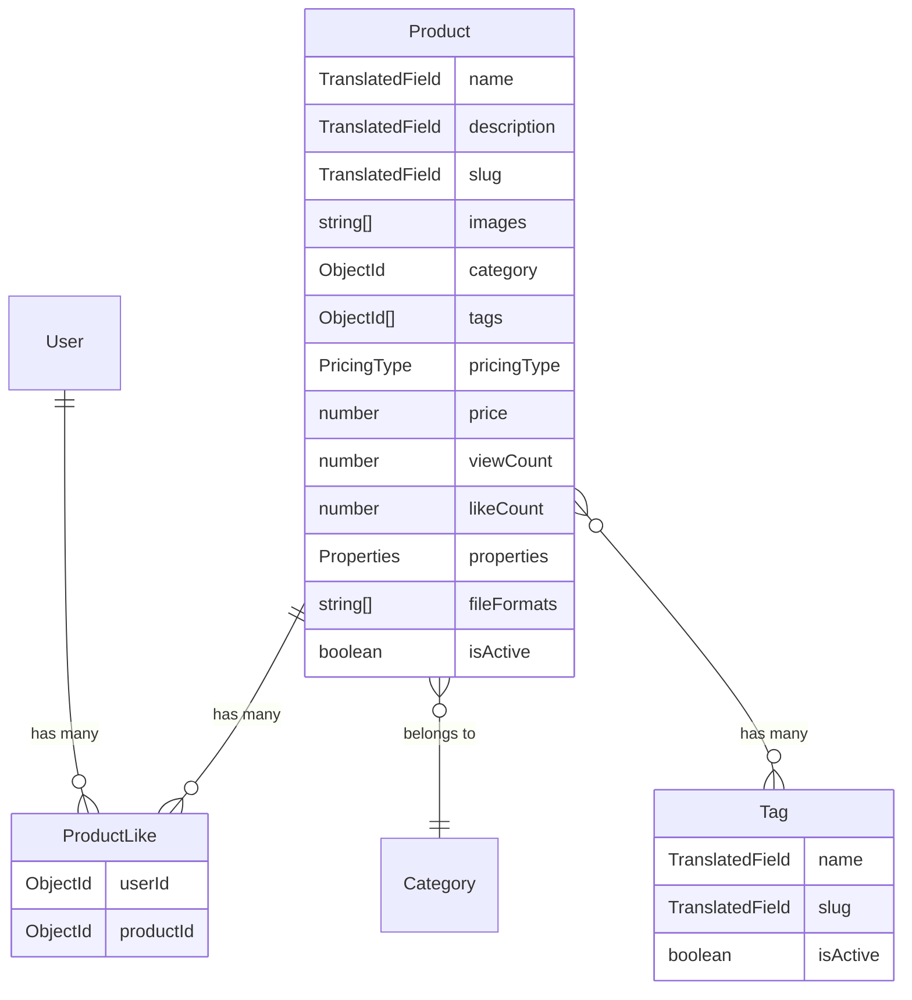

# Product CRUD Implementation

## Data Model Design

Based on the screenshot (3D print model marketplace) and your requirements, here is the schema design:



### Pricing model

An enum `PricingType` with values: `free`, `paid`, `subscription`. The `price` field (number in sum) is only relevant when `pricingType` is `paid`.

### Product properties (embedded subdocument)

```typescript
{
  size: string | null; // e.g. "56 EU / 7.5 US"
  material: string | null; // e.g. "Resin, Metal"
  color: string | null; // e.g. "Gold, Silver"
  weight: string | null; // e.g. "15g"
}
```

### File formats

A simple `string[]` -- e.g. `["STL", "AMF", "3DS", "3DM"]` matching the screenshot.

### ProductLike (wishlist)

Separate collection with a unique compound index on `(userId, productId)` to track which users added a product to their wishlist. `likeCount` on Product is a denormalized counter for fast reads.

---

## Files to Create

All new files follow the exact same patterns as the existing Category implementation.

### 1. Models

- **[src/models/tag.model.ts](src/models/tag.model.ts)** -- `Tag` model with `ITranslatedField` for `name`, auto-generated `slug`, `isActive`. Reuses `ITranslatedField` and `translatedFieldSchema` (extract shared schema to a common location or re-declare like category does).
- **[src/models/product.model.ts](src/models/product.model.ts)** -- `Product` model with all fields above. Refs to `Category`, `Tag`. Text index on `name.en`, `name.ru`, `description.en`, `description.ru`. Indexes on `category`, `pricingType`, `isActive`, unique slug per language.
- **[src/models/product-like.model.ts](src/models/product-like.model.ts)** -- `ProductLike` model with `userId`, `productId`, unique compound index `{ userId: 1, productId: 1 }`.

### 2. DTOs

- **[src/dtos/tag.dto.ts](src/dtos/tag.dto.ts)** -- `TagDto` interface and `toTagDto()` mapper.
- **[src/dtos/product.dto.ts](src/dtos/product.dto.ts)** -- `ProductDto`, `ProductDetailDto` (with populated category/tags), `ProductListItemDto` interfaces and mapper functions.

### 3. Validators (Zod)

- **[src/validators/tag.validator.ts](src/validators/tag.validator.ts)** -- `createTagSchema`, `updateTagSchema`, `listTagsSchema` with exported input types.
- **[src/validators/product.validator.ts](src/validators/product.validator.ts)** -- `createProductSchema`, `updateProductSchema`, `listProductsSchema`. Validates pricing (price required when `pricingType` is `paid`), properties subdocument, `fileFormats` as string array, `images` as string array, `category` as ObjectId string, `tags` as ObjectId string array.

### 4. Services

- **[src/services/tag.service.ts](src/services/tag.service.ts)** -- CRUD: `createTag`, `getTagById`, `listTags`, `updateTag`, `deleteTag`. Slug auto-generation via `slugify()`. Conflict checks on slug uniqueness.
- **[src/services/product.service.ts](src/services/product.service.ts)** -- Full CRUD:
  - `createProduct` -- validate category exists, validate tags exist, generate slug, create
  - `getProductById` -- populate category and tags, increment `viewCount`
  - `listProducts` -- paginated, filterable by category/pricingType/isActive/tags, fuzzy search
  - `updateProduct` -- partial update, re-slug if name changes
  - `deleteProduct` -- delete product, delete associated likes, delete images from R2 via `deleteByPrefix`
  - `toggleLike` -- add/remove ProductLike, update denormalized `likeCount`
  - `getUserWishlist` -- list products liked by a user (paginated)

### 5. Controllers

- **[src/controllers/tag.controller.ts](src/controllers/tag.controller.ts)** -- Thin handlers delegating to tag service. Pattern: `CatchAsyncErrors` wrapper, call service, return via `success()`.
- **[src/controllers/product.controller.ts](src/controllers/product.controller.ts)** -- Thin handlers for all product endpoints including like toggle.

### 6. Routes

- **[src/api/v1/routes/tag.routes.ts](src/api/v1/routes/tag.routes.ts)** -- Admin-only CRUD routes + public list/get:
  - `POST /` -- admin, `validateBody(createTagSchema)`
  - `GET /` -- public, `validateQuery(listTagsSchema)`
  - `GET /:id` -- public
  - `PUT /:id` -- admin, `validateBody(updateTagSchema)`
  - `DELETE /:id` -- admin
- **[src/api/v1/routes/product.routes.ts](src/api/v1/routes/product.routes.ts)** -- Admin CRUD + public read + authenticated like:
  - `POST /` -- admin, `validateBody(createProductSchema)`
  - `GET /` -- public, `validateQuery(listProductsSchema)`
  - `GET /:id` -- public (increments views)
  - `PUT /:id` -- admin, `validateBody(updateProductSchema)`
  - `DELETE /:id` -- admin
  - `POST /:id/like` -- authenticated user (toggle wishlist)
  - `GET /wishlist` -- authenticated user (get user's wishlist)

---

## Files to Modify

- **[src/utils/enums.ts](src/utils/enums.ts)** -- Add `PricingType` enum (`Free`, `Paid`, `Subscription`) and extend `UploadFolder` with `Products = 'products'` and `Tags = 'tags'`.
- **[src/api/v1/index.ts](src/api/v1/index.ts)** -- Register `productRouter` at `/products` and `tagRouter` at `/tags`.

---

## Implementation Order

Work proceeds bottom-up: enums -> models -> DTOs -> validators -> services -> controllers -> routes -> route registration.
